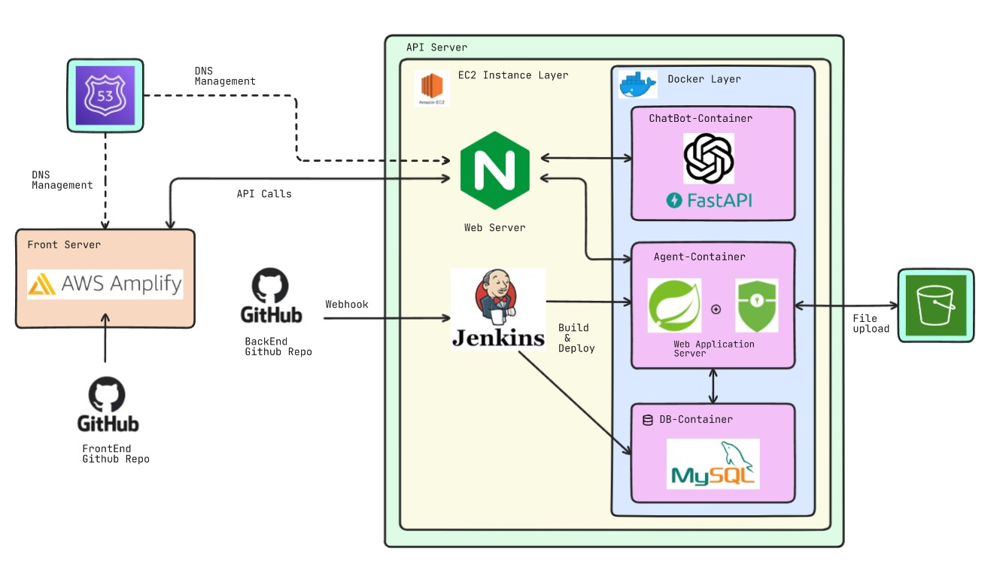

# would-you-hana-BE
📁 우주하나 BE 레포지토리

멤버: 박시홍, 김채운, 김상현, 김해원, 박지환, 정연채, 정승용
- API 명세 : https://www.notion.so/API-11f6edd1e95780f28248c14e54e34288

## 기술 스택
- **"Java"**: "17"
- **"Spring Boot"**: "^3.3.4"
  - **"Spring Security"**
  - **"Spring Data JPA"**
  - **"Lombok"**
- **"MySQL server"**: "^8.0.20", 
- **"Spring Cloud for AWS"**: "^2.2.6",

## 프로젝트 아키텍처

## 커밋 규칙

- `feat`:새로운 기능 추가
- `fix`: 버그 수정
- `docs`: 문서 수정
- `style`: 코드 포맷팅, 세미클론 누락, 코드 변경이 없는 경우
- `refactor`: 코드 리팩토링
- `test`: 테스트 코드, 리팩토링 테스트 코드 추가
- `chore`: 빌드 업무 수정, 패키지 매니저 수정
- `ui`: html/css 수정
